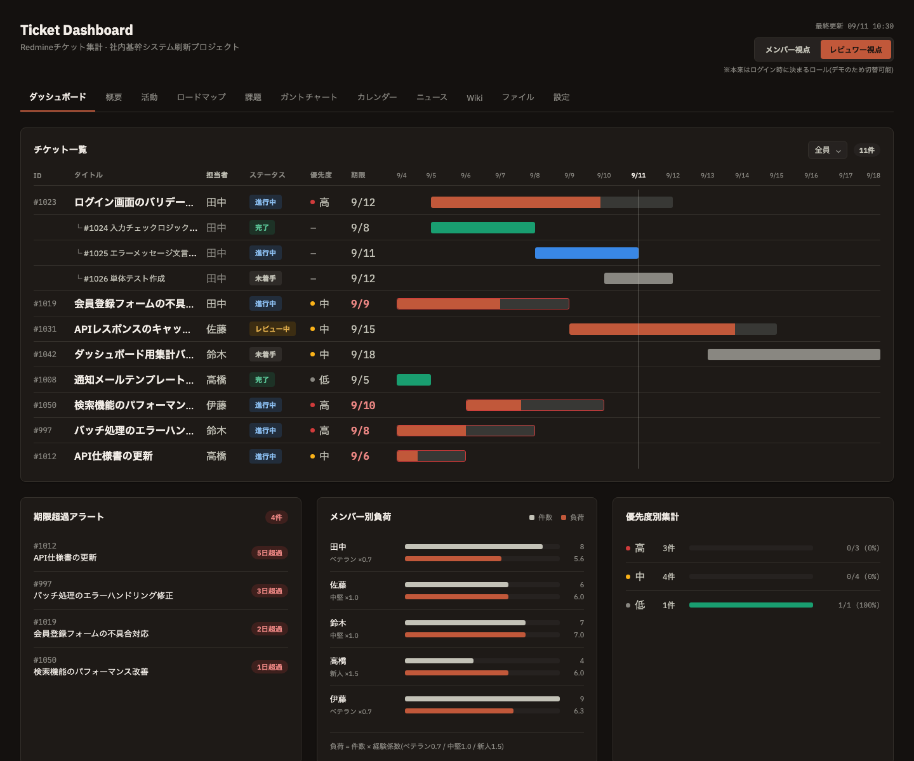

# Redmine WBS・ダッシュボード拡張

90分ハッカソン向けに作成した、Redmineのチケット管理を拡張するプロトタイプです。ビルド不要・`index.html` をブラウザで直接開くだけで動作します。

**🔗 デモを見る: https://keisukefuruta.github.io/redmine-ticket-dashboard/**



## 背景・目的

Redmineは業務のチケット管理基盤として使われているが、以下の課題がある。

- チケット一覧・ステータス変更がフォーム操作中心で、WBS/ボードのように直感的に動かせない
- 集計が「総数」中心で、誰にどれだけ負荷が寄っているか、状況別の内訳が見えにくい

ダミーデータを用いて、**WBS風に操作できる画面**と**多軸集計ダッシュボード**をセットで作成した。ベースはRedmineで、そこにダッシュボードを集約させるイメージ。

## 主な機能

- **チケット一覧+ガントチャート統合ビュー**: 1チケット=1行でID・タイトル・担当者・ステータス・優先度・期限とガントバーを横並び表示。親子チケットはインデント+ツリー記号で階層表示
- **役割トグル(メンバー視点 / レビュワー視点)**: 認証は行わず、画面上のトグルで表示ウィジェットを切替
- **担当者フィルタ**: レビュワー視点では他メンバーのチケットも横断的に確認可能
- **期限超過アラート**: 期限切れチケットを赤バッジ+超過日数で表示
- **次にやるべきタスク**(メンバー視点): 優先度・期限の近さから上位タスクを自動抽出し、理由タグ付きで提示
- **メンバー別負荷**(レビュワー視点): 経験レベルによる重み付けスコアを単純件数と並べて可視化(本ハッカソンの肝)
- **優先度別集計 / バージョン別進捗**(レビュワー視点・共通): 優先度ごとの完了率、バージョンごとの進捗ドーナツグラフ
- **Redmine風メニューバー**: ダッシュボード/課題/ガントチャートの3タブが機能し、他タブは見た目のみ

### 担当負荷の重み付けロジック

チケットの「単純な件数」ではなく、経験レベルで重み付けした負荷スコアを算出する。

| レベル | ウェイト |
|---|---|
| ベテランエンジニア | 0.7 |
| 中堅エンジニア(基準) | 1.0 |
| 新人エンジニア | 1.5 |

計算式: `負荷スコア = チケット数 × 経験レベルウェイト`

件数は同じでも負荷は異なることを示すため、新人(件数4件→負荷6.0)がベテラン(件数8件→負荷5.6)を上回る例で可視化している。

## 使い方

ビルド不要。`index.html` をブラウザで直接開くだけで動作する。

```bash
open index.html
```

## 成果物

| ファイル | 内容 |
|---|---|
| [`index.html`](index.html) | 動くプロトタイプ本体 |
| [`requirements.md`](requirements.md) | 要件定義書・実装状況の詳細 |
| [`dashboard-mockup/`](dashboard-mockup/) | デザインモックアップ(静的イメージ) |

## スコープ方針(90分ハッカソン前提)

- Redmine連携: 実API接続はせず、チケット/ユーザーのダミーデータをJSで直接保持
- ダッシュボード構成: 固定レイアウト(ウィジェット自由配置なし)
- 認証・権限: 作らず、同一画面上のトグルで視点を切替
- 永続化: DB保存はせず、フロント側のstateで完結

## 実装状況

ダミーデータ・チケット一覧+ガント統合ビュー・役割トグル・各種ダッシュボードウィジェットは実装済み。ボード画面(D&D)は未実装。詳細は [`requirements.md`](requirements.md) を参照。

## 今後の課題

- ボード画面(D&D)の実装
- 「次にやるべきタスク」のランキングロジックの見直し(期限超過と優先度の優先順位)
- 実データ/Redmine API連携の検討
